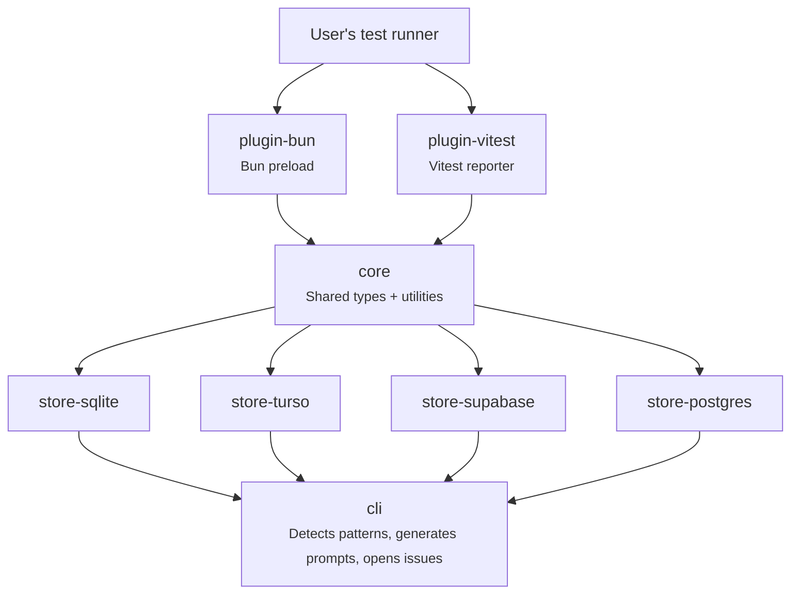

# Package Developer Guide

This guide explains each package in the monorepo, how they connect, and the gotchas you'll hit when working on them.

## How the packages fit together

**Data flow**: Plugin captures failure → writes to store → CLI reads from store → detects flaky patterns → generates prompt or GitHub issue.

---

## @flaky-tests/core

**What it does**: Defines the `IStore` interface that all store adapters implement, plus shared types and utility functions.

**Key files**:
- `types.ts` — `IStore`, `FlakyPattern`, `InsertRunInput`, etc.
- `categorize.ts` — Classifies errors as `assertion`, `timeout`, `uncaught`, or `unknown`
- `validate.ts` — `validateTablePrefix()` for SQL injection prevention
- `store-utils.ts` — `stripTimestampPrefix()` used by all stores
- `schemas.ts` — ArkType schemas for runtime validation

### Gotchas

**If you change `IStore`, every store breaks.** The interface is implemented by 4 store packages. Adding a method means updating all 4. Make new methods required (not optional) — optional methods on interfaces are hard to discover and easy to forget.

**`stripTimestampPrefix()` relies on a `CHAR(1)` separator.** The stores use a trick where `MAX(timestamp || CHAR(1) || payload)` picks the most recent payload. This function strips that prefix. If you change the separator character in any store's SQL, you must update this function too.

**Types are derived from ArkType schemas.** The types like `FlakyPattern` are defined as `typeof flakyPatternSchema.infer`, not as standalone interfaces. If you need to change a type, edit the schema in `schemas.ts` — the type updates automatically.

---

## @flaky-tests/store-sqlite

**What it does**: Stores test runs and failures in a local SQLite file using Bun's built-in `bun:sqlite`.

**Key files**:
- `index.ts` — `SqliteStore` class (main store)
- `report.ts` — Standalone HTML report generator (reads from the DB directly)

### Gotchas

**This package only works in Bun.** It imports `bun:sqlite` which doesn't exist in Node.js. If someone tries to use this from Node, it will fail. This is intentional — use `store-turso` or `store-postgres` for Node compatibility.

**Migration is automatic.** The constructor calls `this.db.exec(SCHEMA)` and then `this.migrate()`. Unlike Turso/Postgres, you don't need to call `migrate()` manually. The `migrate()` method is still public (required by `IStore`) but calling it again is harmless.

**SQLite has no `ADD COLUMN IF NOT EXISTS`.** The `migrate()` method uses a try/catch loop — it tries each `ALTER TABLE ADD COLUMN` and catches the "column already exists" error. This is ugly but it's the only way in SQLite.

**`reconcileRun()` is SQLite-only.** This method isn't on `IStore`. It's called by `run-tracked.ts` when the test process exits non-zero but the preload recorded `status='pass'`. This catches cases where Bun crashes after all tests pass but before the `afterAll` hook runs. If you're adding a new store and need this, you'd need to add it to `IStore` first.

**`report.ts` is a separate entry point.** It's exported as `@flaky-tests/store-sqlite/report` and has its own CLI. It reads the DB directly (not through `IStore`) for richer queries. This is fine for SQLite since the DB is local, but the pattern doesn't generalize to remote stores.

---

## @flaky-tests/store-turso

**What it does**: Same as store-sqlite but connects to a remote [Turso](https://turso.tech) database via the libSQL client.

### Gotchas

**You must call `migrate()` before first use.** Unlike SQLite, the Turso constructor does NOT auto-migrate. If you forget, all writes will fail with "table not found". This is because migration requires async network calls, and constructors can't be async.

**The SQL is almost identical to SQLite but not copy-paste safe.** Turso speaks SQLite's dialect, but the `@libsql/client` library uses `?` parameter placeholders and returns `Value` types that need `String()` / `Number()` conversion. SQLite's `bun:sqlite` uses typed `.query<Row, Params>()`. Don't assume changes to one store can be blindly copied to the other.

**`InArgs` casts are necessary.** The libsql type system requires `as InArgs` on parameter arrays. These look like unsafe casts but they're required by the library's type signature.

---

## @flaky-tests/store-supabase

**What it does**: Stores data via the Supabase REST API using `@supabase/supabase-js`.

### Gotchas

**No server-side SQL.** Unlike the other stores, Supabase can't run raw SQL queries through the JS client. This means:
- `migrate()` can't create tables — it only validates they exist and throws a helpful error if not
- `getNewPatterns()` fetches ALL failure rows to the client and does aggregation in JavaScript
- This works fine for small-to-medium datasets but will be slow with thousands of failures

**Client-side aggregation means different performance characteristics.** The other 3 stores do the windowed comparison query server-side. Supabase fetches every failure row from both windows and groups them in a `Map` in JS. If you're optimizing the detection query, changes in SQL-based stores won't apply here — you'd need to optimize the JS loop.

**`tablePrefix` flows into `.from()` calls.** The Supabase client's `.from(tableName)` doesn't do any SQL escaping internally — it's a REST API endpoint name. The `validateTablePrefix()` call in the constructor prevents injection, but be aware that the table name is used as a URL path segment, not a SQL identifier.

**No `close()` needed.** The Supabase JS client manages connections internally. The `close()` method is a no-op to satisfy the `IStore` interface.

---

## @flaky-tests/store-postgres

**What it does**: Stores data in any PostgreSQL-compatible database (Postgres, Neon, AWS RDS, etc.) using the `postgres` library.

### Gotchas

**Tagged template SQL is NOT the same as string interpolation.** The `postgres` library uses tagged template literals: `` this.sql`SELECT * FROM ${this.sql(tableName)}` ``. This looks like string interpolation but it's actually parameterized queries. The `${value}` parts become SQL parameters (safe from injection). The `${this.sql(identifier)}` parts are identifier escaping for table/column names.

**Table names use `this.sql(name)` — not raw interpolation.** If you see `` ${this.sql(failures)} `` in a query, that's identifier quoting (like `"flaky_test_failures"`). If you see `` ${someValue} ``, that's a parameterized value. Mixing these up creates SQL injection vulnerabilities.

**Timestamps are `TIMESTAMPTZ`, not `TEXT`.** SQLite and Turso store timestamps as ISO 8601 text strings. Postgres uses native `TIMESTAMPTZ` columns. This means:
- The `postgres` library returns `Date` objects, not strings (see `r.last_failed.toISOString()`)
- The timestamp-prefix trick uses `failed_at::text` to cast to string before concatenation
- `stripTimestampPrefix()` uses dynamic separator detection because Postgres text timestamps vary in length

**`migrate()` creates tables and indexes.** Unlike Supabase, Postgres supports `CREATE TABLE IF NOT EXISTS` through the JS client, so migration is fully automated.

---

## @flaky-tests/plugin-bun

**What it does**: Hooks into Bun's test runner via `mock.module('bun:test')` to intercept every test and record failures.

**Key files**:
- `preload.ts` — The core monkey-patching logic
- `preload-sqlite.ts` — Wires `preload.ts` to a SQLite store (the default entry point)
- `run-tracked.ts` — Wrapper that spawns `bun test` as a subprocess for exit-code reconciliation
- `git.ts` — Captures git SHA and dirty state

### Gotchas

**This is a monkey-patch, not an API.** The plugin works by replacing `bun:test`'s `test`, `it`, and `describe` functions with Proxy-wrapped versions. This is fragile — if Bun changes how `mock.module()` works or how test registration happens, this will break. The Proxy approach is necessary to preserve sub-APIs like `.each`, `.skip`, `.only`, `.todo`.

**`done`-callback tests are NOT wrapped.** If a test function takes a `done` parameter (`test('foo', (done) => { ... })`), the wrapper skips it (line 147: `if (fn.length > 0) return originalTest(name, fn, timeout)`). This is because wrapping would change the function's `length` property, which Bun uses to detect callback-style tests. These tests won't have failures captured.

**`safeVoid()` swallows errors.** All store writes use `safeVoid()` which catches and logs errors but never throws. This is deliberate — a crash in the flaky-test tracking should never break the user's actual test run. But it means failures can be silently lost if the store is misconfigured.

**`run-tracked.ts` is tightly coupled to SQLite.** It imports `SqliteStore` directly and calls `store.reconcileRun()` which isn't on `IStore`. If you want run reconciliation for other stores, you'd need to either add `reconcileRun()` to `IStore` or create store-specific tracked runners.

**`FLAKY_TESTS_RUN_ID` env var connects preload and run-tracked.** When `run-tracked.ts` spawns `bun test`, it generates a UUID and passes it via this env var. The preload picks it up so both sides reference the same run row. If this env var is missing, the preload generates its own UUID (standalone mode).

**`git.ts` uses `Bun.spawnSync`.** The vitest plugin has its own copy of this logic using Node's child_process module instead. They do the same thing but with different APIs because plugin-vitest needs to work without Bun. If you change the git-info logic, remember to update both places.

---

## @flaky-tests/plugin-vitest

**What it does**: Implements Vitest's `Reporter` interface to capture test failures.

### Gotchas

**Cross-version compatibility is tricky.** The reporter must work with Vitest 1.x, 2.x, and 3.x. The `TaskBase` interface is defined locally (not imported from vitest) because the vitest type has changed across versions. If you import vitest's `Task` type directly, it will break for users on older versions.

**`onFinished` fires in watch mode too.** In `vitest --watch`, `onFinished` fires after each re-run. The current implementation uses one `runId` per reporter instance. If Vitest reuses the reporter instance across watch re-runs, subsequent runs overwrite the same row. This is documented in the JSDoc but easy to miss.

**Failures are inserted sequentially, not in parallel.** The `for (const failure of failureInputs)` loop awaits each insert one at a time. For remote stores (Supabase, Turso, Postgres), this could be slow with many failures. A `Promise.all()` batch would be faster but risks overwhelming the DB with concurrent writes.

**`captureGitInfo()` is duplicated from plugin-bun.** This function exists in both packages. They do the same thing but use different APIs (`Bun.spawnSync` vs Node's child_process). This is a known duplication — extracting to core would require core to depend on a runtime-specific API, which breaks its runtime-agnostic design.

---

## @flaky-tests/cli

**What it does**: Reads from a store, detects newly-flaky test patterns, and either prints prompts, copies to clipboard, generates HTML reports, or opens GitHub issues.

**Key files**:
- `check.ts` — Main CLI entry point (argument parsing, orchestration)
- `prompt.ts` — Generates AI investigation prompts
- `github.ts` — GitHub REST API helpers (issue creation, repo resolution)
- `html.ts` — Generates self-contained HTML reports
- `index.ts` — Public API re-exports

### Gotchas

**`resolveStore()` uses dynamic imports.** The store adapters (turso, supabase, postgres) are imported with `await import(...)` so they're only loaded if the user selects that store. This keeps the CLI lightweight — you don't need `@libsql/client` installed if you're using SQLite. But it means these imports can fail at runtime if the package isn't installed (they're `optionalDependencies`).

**Argument parsing is hand-rolled.** There's no library — just `process.argv.includes()` and `process.argv.indexOf()`. This keeps dependencies at zero but means no automatic help generation, no subcommand routing, and easy-to-miss edge cases. The `--repo` flag is parsed in `github.ts` (not `check.ts`), which is inconsistent.

**Exit codes matter for CI.** Exit 0 = clean, exit 1 = flaky patterns found, exit 2 = bad input. CI pipelines use exit codes to determine pass/fail, so changing these breaks workflows.

**GitHub API responses are thrown as-is on error.** In `github.ts`, `createIssue()` throws the raw response body on failure. This could include sensitive details. The error propagates to the console in `check.ts`. If you're adding error handling, sanitize or truncate the response body.

**The HTML report is fully self-contained.** `html.ts` generates a single HTML file with inline CSS and JavaScript — no external resources. The copy-to-clipboard uses the `navigator.clipboard` API with a fallback to text selection. If you modify the template, test it in a browser — template literals with backticks inside backticks are easy to break.

---

## Common patterns across all packages

### `parse()` and `parseArray()`

All store methods validate inputs at runtime using ArkType schemas via `parse()` from core. This catches type errors early (e.g., passing `undefined` where a string is required) rather than letting them propagate to a cryptic database error.

### Error handling philosophy

- **Plugins (preload, reporter)**: Never throw — swallow errors with logging. The user's tests must not be affected by our tracking.
- **Stores**: Throw on database errors — the caller decides how to handle.
- **CLI**: Catch and display user-friendly messages. Use exit codes for CI.

### Testing

Tests are colocated (`*.test.ts` next to `*.ts`). Run `bun test` for unit tests, `bun run test:integration` for integration tests (remote stores). Integration tests are guarded by `describe.skipIf(!process.env.INTEGRATION)` and skipped during normal runs.
